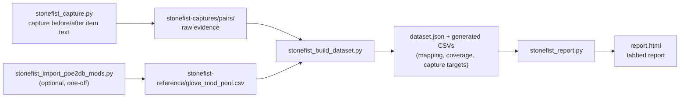
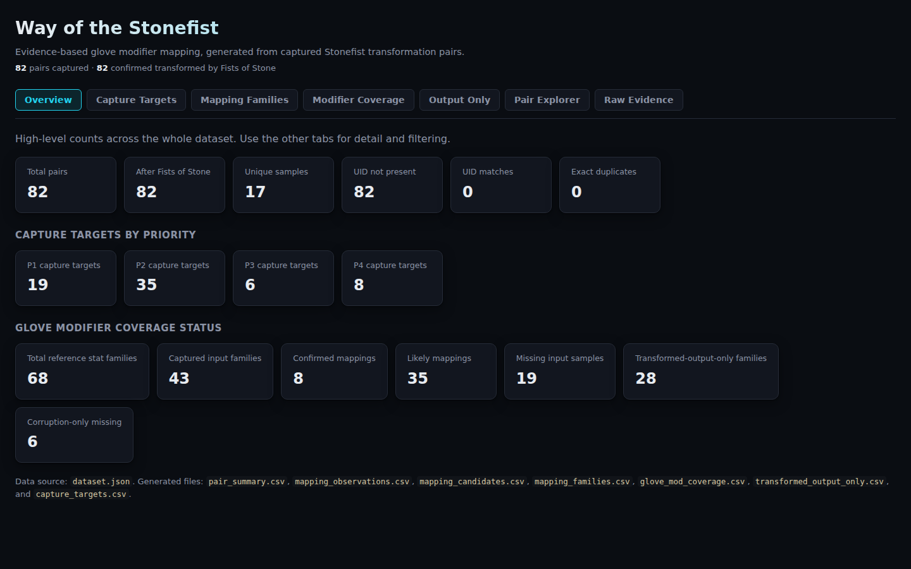
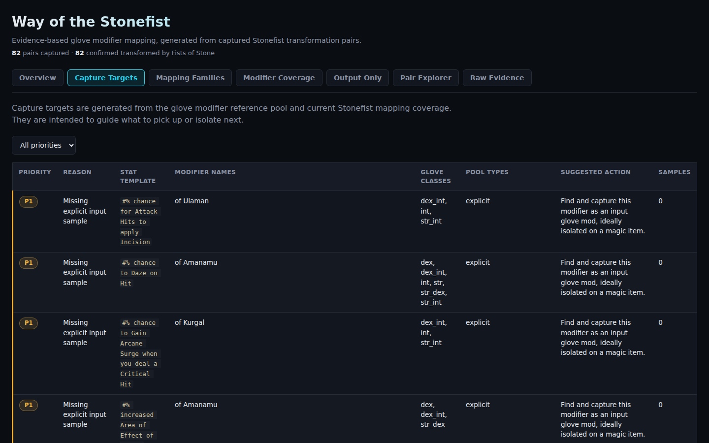
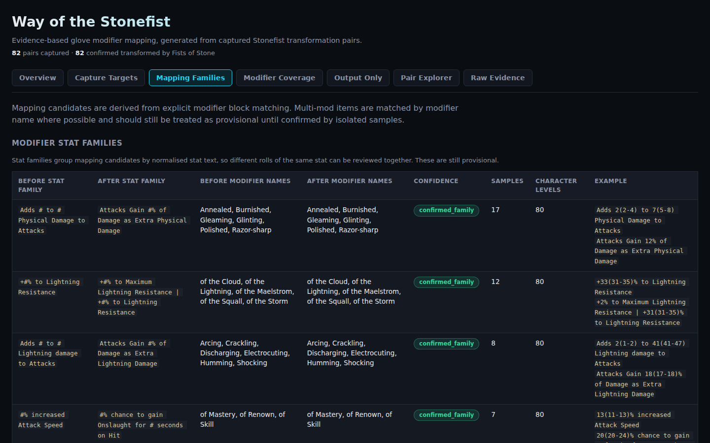
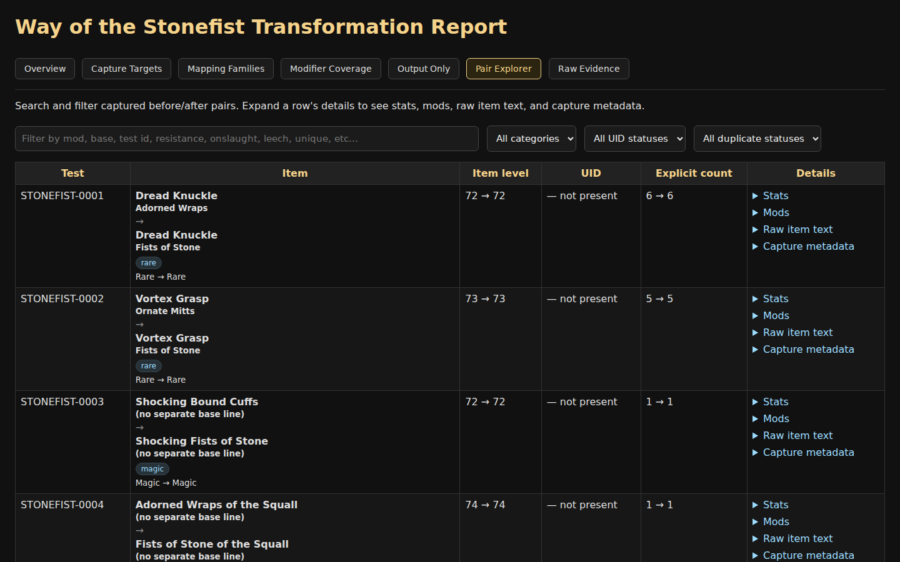

# Stonefist Tool

A small toolchain for capturing, building, and reporting Way of the Stonefist item transformation pairs, and for cross-referencing transformed gloves against a PoE2DB glove modifier reference pool.

## What this is for

Path of Exile 2's Way of the Stonefist transforms a pair of gloves into a unique item, and it is not obvious which modifiers on the original gloves lead to which modifiers on the result.

This tool exists to answer that question with evidence instead of guesswork:

- Capture real before/after glove pairs as you use Stonefist in-game.
- Automatically build a searchable dataset from everything captured so far.
- Cross-reference against the known pool of glove modifiers from PoE2DB.
- Generate a single readable HTML report showing what is confirmed, what is likely, and what still needs more data.

You do not need to read or write Python to use this. See `docs/README.md` for a visual walkthrough of the report, or read on for the full details.

## Visual overview



## Screenshots

Screenshots of the generated report live under `docs/assets/`. If you regenerate the report, feel free to refresh these with your own captures of `stonefist-captures/report.html`.

**Overview** - high-level dataset counts and priority/coverage summaries:



**Capture Targets** - prioritised list of what to capture or isolate next:



**Mapping Families** - what Stonefist appears to turn each modifier into:



**Pair Explorer** - every captured before/after pair, individually searchable:



## Files

- `stonefist_capture.py` - captures clipboard `before`/`after` item text and saves raw evidence under `stonefist-captures/pairs/`.
- `stonefist_import_poe2db_mods.py` - imports the glove modifier reference pool from local PoE2DB page snapshots, or with `--fetch` to download them, into `stonefist-reference/glove_mod_pool.csv` and `stonefist-reference/glove_mod_pool.json`. Never runs automatically.
- `stonefist_build_dataset.py` - parses raw pairs and the reference pool into `stonefist-captures/dataset.json`, `pair_summary.csv`, `mod_lines.csv`, `mapping_observations.csv`, `mapping_candidates.csv`, `mapping_families.csv`, `glove_mod_coverage.csv`, `transformed_output_only.csv`, and `capture_targets.csv`.
- `stonefist_report.py` - thin entry point; delegates to the `stonefist_reporter` package (`loaders.py`, `sections.py`, `assets.py`, `render.py`), which reads the generated dataset and CSVs and writes `stonefist-captures/report.html`.

## Requirements

- Python 3.12 or newer.
- [`uv`](https://docs.astral.sh/uv/) is recommended for running everything with the correct interpreter and pinned dependencies. After cloning, run `uv sync` once to create `.venv` with `pyperclip` (capture) and `pytest` (tests) installed.
- Capturing (`stonefist_capture.py`) needs `pyperclip` for clipboard access, which is a declared project dependency (installed automatically by `uv sync`). Clipboard access itself depends on your OS having a working clipboard backend:
  - Windows: works out of the box.
  - Linux/macOS: needs a clipboard tool available (e.g. `xclip`/`xsel` on X11, or a Wayland equivalent).
  - **WSL2**: tested working - pyperclip talks to the real Windows clipboard via `clip.exe`/`powershell.exe`, both already on `PATH` in a standard WSL2 setup, so no extra install is needed there.
- `stonefist_build_dataset.py`, `stonefist_report.py` (and the `stonefist_reporter` package), and `stonefist_import_poe2db_mods.py` use only the Python standard library. On a system with Python 3.12+ already installed, plain `python3 stonefist_build_dataset.py` / `python3 stonefist_report.py` work identically without `uv`. Only capture needs `pyperclip` installed some other way (e.g. `pip install pyperclip`) if you're not using `uv`.

## Workflow

Recommended: run `uv sync` once after cloning (see Requirements above).

1. Capture raw item pairs:

```bash
uv run python stonefist_capture.py
```

Capture prompts for a character level and then for optional **session notes** at startup ("Session notes, or blank to skip:"). The session note is stored in every pair's `meta.json` under `notes` for that run, useful for flagging control captures, desecrated mods, off-class essence/crafted mods, corrupted items, etc. For example:

- `Normal white base control. No explicit modifiers. DEX base.`
- `Desecrated dual-resistance target.`
- `Essence-forced off-class evasion mod.`

Pass `--prompt-notes` to additionally be asked for a note after each individual pair is saved:

```bash
uv run python stonefist_capture.py --prompt-notes
```

You'll see `Notes for STONEFIST-XXXX, blank to keep session/default notes:` after each pair. Leaving it blank keeps the session note; typing something stores that note for this pair only. Off by default, so existing capture behaviour is unchanged unless you opt in.

2. Optional, one-off: populate the glove modifier reference pool. Save PoE2DB page snapshots into `stonefist-reference/raw-poe2db/`, see its README, or pass `--fetch` to download them automatically:

```bash
uv run python stonefist_import_poe2db_mods.py
```

3. Build the dataset:

```bash
uv run python stonefist_build_dataset.py
```

4. Generate the report:

```bash
uv run python stonefist_report.py
```

5. Run the test suite:

```bash
uv run pytest
```

Steps 3 and 4 also work as plain `python3 stonefist_build_dataset.py` / `python3 stonefist_report.py` on any system with Python 3.12+, since neither has third-party dependencies - see Requirements above.

## Reference source

The glove modifier reference pool is imported from local snapshots of the PoE2DB glove modifier pages:

- https://poe2db.tw/us/Gloves_str#ModifiersCalc
- https://poe2db.tw/us/Gloves_dex#ModifiersCalc
- https://poe2db.tw/us/Gloves_int#ModifiersCalc
- https://poe2db.tw/us/Gloves_str_dex#ModifiersCalc
- https://poe2db.tw/us/Gloves_str_int#ModifiersCalc
- https://poe2db.tw/us/Gloves_dex_int#ModifiersCalc

Snapshots are stored under `stonefist-reference/raw-poe2db/`.

The importer reads those local snapshots by default and writes:

- `stonefist-reference/glove_mod_pool.csv`
- `stonefist-reference/glove_mod_pool.json`

The importer may be run with `--fetch` to refresh snapshots from PoE2DB, but fetching is never performed by the build or report scripts.

## Generated outputs

The build step produces derived data under `stonefist-captures/`:

- `dataset.json` - parsed pair data used by the report.
- `pair_summary.csv` - one row per before/after pair.
- `mod_lines.csv` - extracted modifier/stat lines.
- `mapping_observations.csv` - raw explicit modifier mapping observations.
- `mapping_candidates.csv` - provisional explicit modifier mapping candidates.
- `mapping_families.csv` - normalised before/after stat-family mappings.
- `glove_mod_coverage.csv` - comparison between the PoE2DB glove modifier pool and captured Stonefist data.
- `transformed_output_only.csv` - Stonefist output stat templates not present in the loaded glove modifier reference pool.
- `capture_targets.csv` - prioritised list of modifiers worth hunting or isolating next.
- `report.html` - static human-readable report.

## Reading the report

`stonefist-captures/report.html` is a static tabbed report generated from the captured item pairs and the loaded glove modifier reference pool.

### Overview

Shows high-level dataset counts, including total pairs, transformed pairs, unique samples, UID status, duplicate count, capture target priority counts, and glove modifier coverage counts.

Use this tab as a quick sanity check after rebuilding the dataset.

### Capture Targets

Shows what is still worth capturing or isolating next.

Priority meanings:

- `P1` - missing explicit input sample. The modifier exists in the glove reference pool, but has not been captured as a Stonefist input yet.
- `P2` - likely mapping needs isolated confirmation. The mapping has evidence, usually from multi-mod items, but still needs a clean isolated sample.
- `P3` - corruption-only missing. The modifier appears only in corrupted/enchantment reference data and has not been captured.
- `P4` - confirmed mapping. No immediate action needed.

For normal data collection, prioritise `P1` first, then `P2`.

### Mapping Families

Groups observed before/after transformations by normalised stat text.

This is the main tab for understanding what Stonefist appears to do to each modifier family.

### Modifier Coverage

Compares the PoE2DB glove modifier reference pool against the currently captured Stonefist data.

Use this tab to see which reference modifier families are confirmed, likely, missing, or corruption-only.

### Output Only

Shows stat templates that appear after Stonefist transformation but are not present in the loaded glove reference pool.

These are not directly targetable as glove input mods unless they also appear in the reference pool.

### Pair Explorer

Shows each captured before/after pair.

Use this tab to inspect individual evidence, including item name, base, item level, rarity, explicit count, parsed stats, parsed modifier blocks, raw item text, and capture metadata.

### Raw Evidence

Raw before/after item text is not duplicated in this tab. It remains available inside each `Pair Explorer` row under the collapsed `Raw item text` section.

## Capture workflow

Recommended loop:

1. Open `stonefist-captures/report.html`.
2. Go to `Capture Targets`.
3. Filter for `P1`.
4. Find or craft a glove with one of those missing input modifiers.
5. Prefer isolated magic items where possible.
6. Capture the before/after pair with `stonefist_capture.py`.
7. Rebuild the dataset with `stonefist_build_dataset.py`.
8. Regenerate the report with `stonefist_report.py`.
9. Check whether the target moved from `missing_input_sample` or `likely_mapping` into confirmed coverage.

For confirmation quality, prefer:

- one explicit modifier on a magic item
- two explicit modifiers only if the modifier names are unambiguous
- rare multi-mod items only as provisional evidence

Raw captured evidence under `stonefist-captures/pairs/` should not be edited manually.

## Evidence model

The toolchain separates raw evidence from derived outputs.

Raw evidence:

- `stonefist-captures/pairs/*/before.txt`
- `stonefist-captures/pairs/*/after.txt`
- `stonefist-captures/pairs/*/meta.json`

Derived outputs:

- `dataset.json`
- generated CSV files
- `report.html`

The raw pair folders are the source of truth. The dataset, CSV files, and report can be regenerated from them.

## Data interpretation

Mappings are evidence-based, not assumed final truth.

- `confirmed_mapping` means the mapping has at least one isolated sample.
- `likely_mapping` means the mapping is supported by captured data but still needs isolated confirmation.
- `missing_input_sample` means the modifier exists in the loaded glove reference pool but has not yet been captured as a Stonefist input.
- `corruption_only_missing` means the modifier is present only in the corrupted/enchantment reference pool and has not yet been captured.
- `transformed_output_only` means the stat appears after Stonefist transformation but is not present in the loaded glove input reference pool.

## Notes

- Raw evidence is stored in `stonefist-captures/pairs/` and is never modified by any other step.
- Exact duplicate detection is supported in the dataset pipeline and is included in both `pair_summary.csv` and the generated report.
- Explicit modifier blocks are matched before/after primarily by modifier name, falling back to order only when names are ambiguous. Treat mappings as provisional until confirmed by an isolated sample.
- The build and report scripts never fetch from PoE2DB. Importing the reference pool is a separate, explicit step.
- `capture_targets.csv` ranks reference modifiers by what is still worth capturing, including missing input samples, likely mappings needing isolation, corruption-only gaps, and confirmed mappings. It is surfaced in the report's `Capture Targets` section.
- `stonefist_report.py` includes filters for report tabs such as priority, coverage status, pair search, category, UID status, and duplicate status.
